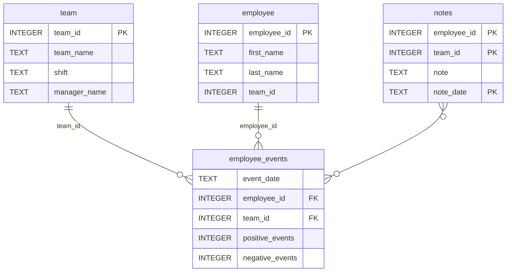

# Software Engineering for Data Scientists Project (Employee Performance Dashboard)

## Overview
This project is a **web-based dashboard** built using **Python**, **FastHTML**, and **Matplotlib** to help managers monitor employee performance and predict recruitment risk. The dashboard leverages a local Python package (`employee_events`) for database queries and integrates predictive analytics using **scikit-learn**.

### Key Features
1. **Cumulative event counts over time**, which refer to individual employees or entire teams' productivity through cumulative event tracking;
2. **Predicted recruitment risk** analyzed using machine learning, displaying likelihood scores with color-coded indicators;
4. **Notes tracking** to display important observations about employees/teams

## Environment Setup

### 1. Clone the Repository
```bash
git clone https://github.com/Hirzahida/dsnd-dashboard-project.git
cd dsnd-dashboard-project
```

### 2. Create and Activate Virtual Environment
```bash
# Create virtual environment
python -m venv venv

# Activate (Linux/Mac)
source venv/bin/activate

# Activate (Windows PowerShell)
venv\Scripts\activate
```

### 3. Install Dependencies
```bash
python -m pip install -r requirements.txt
```

## Important: FastHTML Bug Fix

⚠️ **Required Patch**: The installed version of `python-fasthtml==0.8.0` has a missing import that will cause errors.

**To fix:**
1. Open file: `venv/Lib/site-packages/fasthtml/fastapp.py`
2. Add this line near the top with other imports:
```python
   from typing import Any
```

**Without this patch**, you'll see:
```
NameError: name 'Any' is not defined
```

---

## Running Tests

Verify the database and tables are set up correctly:
```bash
python -m pytest tests/test_employee_events.py -v
```

**Expected output:**
```
tests/test_employee_events.py::test_db_exists PASSED                    [ 25%]
tests/test_employee_events.py::test_employee_table_exists PASSED        [ 50%]
tests/test_employee_events.py::test_team_table_exists PASSED            [ 75%]
tests/test_employee_events.py::test_employee_events_table_exists PASSED [100%]

```

---

## Running the Dashboard

### Start the Application

From the project root directory:
```bash
cd report
python dashboard.py
```

The dashboard will start on **http://localhost:5001** (or the URL shown in your terminal).

### Accessing the Dashboard

- **Default view**: http://localhost:5001
- **Specific employee**: http://localhost:5001/employee/{id}
- **Specific team**: http://localhost:5001/team/{id}

---
## Dashboard Features

**1. Filter Controls**

- **Radio buttons**: Switch between "Employee" and "Team" views
- **Dropdown menu**: Select specific employee or team

**2. Visualizations**

**Line Chart: Cumulative Event Counts Over Time**
- Displays cumulative positive events (blue line) and negative events (orange line)
- X-axis: Timeline of recorded events
- Y-axis: Cumulative count
- Shows employee/team name in title
- Includes error handling for missing data

**Bar Chart: Predicted Recruitment Risk**
- Displays ML model's prediction of recruitment likelihood (0–1 scale)
  
- **Color-coded risk indicators:**
  - 🟢 **Green** (0.0–0.1): Low risk
  - 🟠 **Orange** (0.1–0.2): Medium risk
  - 🔴 **Red** (0.2–1.0): High risk
- Shows individual employee risk or team average
- Includes employee/team name in title

**3. Notes Table**
- Displays chronological notes about the selected employee or team
- Shows note date and content
- Helps managers track important observations and milestones

### Repository Structure
```
├── README.md
├── assets
│   ├── model.pkl
│   └── report.css
├── env
├── python-package
│   ├── employee_events
│   │   ├── __init__.py
│   │   ├── employee.py
│   │   ├── employee_events.db
│   │   ├── query_base.py
│   │   ├── sql_execution.py
│   │   └── team.py
│   ├── requirements.txt
│   ├── setup.py
├── report
│   ├── base_components
│   │   ├── __init__.py
│   │   ├── base_component.py
│   │   ├── data_table.py
│   │   ├── dropdown.py
│   │   ├── matplotlib_viz.py
│   │   └── radio.py
│   ├── combined_components
│   │   ├── __init__.py
│   │   ├── combined_component.py
│   │   └── form_group.py
│   ├── dashboard.py
│   └── utils.py
├── requirements.txt
├── start
├── tests
    └── test_employee_events.py
```

### employee_events.db


## Dependencies

Full list in `requirements.txt`:
```
scikit-learn==1.5.2
python-fasthtml==0.8.0
matplotlib==3.9.2
scipy==1.14.1
numpy==2.1.2
pandas==2.2.3
pytest
flake8
ipython
sqlite-minutils>=0.0.4
-e ./python-package
```

## Licensing, Authors, Acknowledgements

### Project Attribution
This project is part of the **Udacity Data Scientist Nanodegree** - Software Engineering for Data Scientists final project.

### Original Repository
Forked from: [udacity/dsnd-dashboard-project](https://github.com/udacity/dsnd-dashboard-project)

**Original Authors:**
- **joelsewhere** (jo-L)
- **hoffm386** (Erin R Hofmann)

### Acknowledgements
- **Udacity**: For providing the project template and course materials
- **Course instructors**: For guidance on software engineering best practices
- Portions of the code were adapted from classroom exercises and refined to meet project requirements
- AI assistance was used for debugging and code optimization suggestions

### License
If you distribute or reuse this code, please:
- Retain the original copyright notices
- Comply with Udacity's Honor Code and terms of use
- Provide attribution to the original authors


